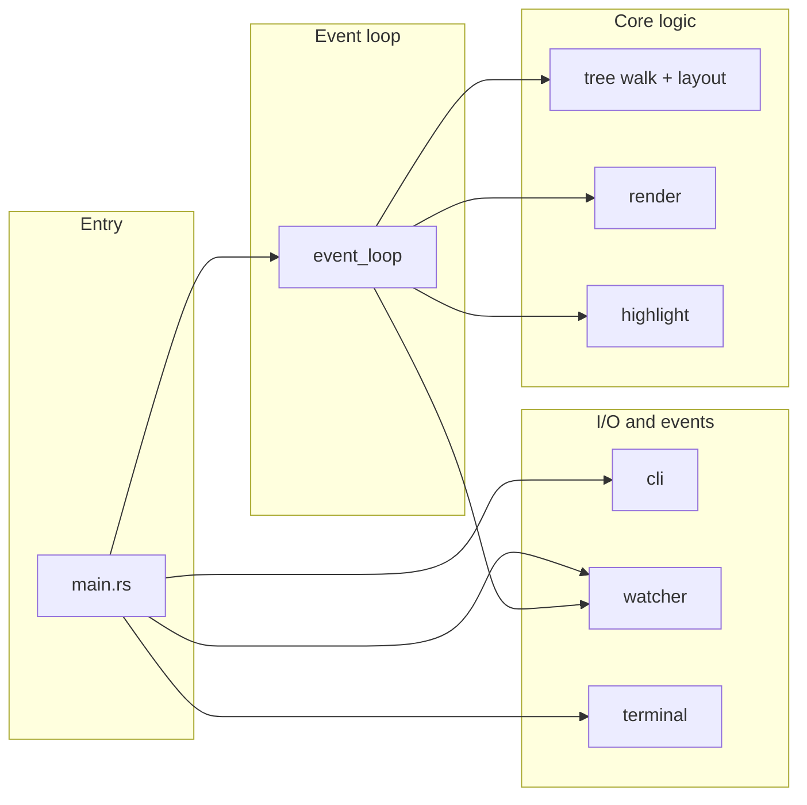

# Code Review Findings

Rust codebase review for quality, SOLID principles, clean architecture, and clean code. Findings are grouped by severity with principle mapping and file references.

**Implementation status:** C1, H1, H2, H3, M2, M3, M4 and the initial DIP/scroll refactors have been implemented. M1 (traits fully exploited), M5 (encara més SRP), i L1–L3 romanen com a refactors opcionals.

---

## Critical

### C1. Ignore patterns match only basename; path-style globs never match

**Principle:** Correctness / Clean code (least surprise).

**Location:** [src/tree/walk.rs](src/tree/walk.rs) lines 45–56.

**Detail:** `filter_entry` uses `ignore_patterns.is_match(name.as_ref())` where `name` is `entry.file_name().to_string_lossy()`. GlobSet matches against the filename only, not the path relative to root. User patterns like `src/**/*.rs` or `target/**` will never match, so ignored directories are still traversed and can appear or affect behavior.

**Suggested fix:** Match against the path relative to the walk root (e.g. `entry.path().strip_prefix(root).unwrap_or(entry.path()).to_string_lossy()`), or document that only basename patterns are supported and reject/warn on patterns containing path separators. **Size:** Medium. **Risk:** Medium (behavior change for existing users relying on current semantics).

---

## High

### H1. `event_loop::run` always returns `Ok(())`; `Result<(), String>` is misleading

**Principle:** Clean code (honest API), Interface Segregation.

**Location:** [src/event_loop.rs](src/event_loop.rs) signature line 169, return at 280.

**Detail:** `run()` only ever returns `Ok(())`. Main’s `if let Err(e) = result { ... }` is dead code. The API suggests an error path that does not exist.

**Suggested fix:** Change return type to `()` and remove the check in [src/main.rs](src/main.rs) (lines 60–63), or introduce a real error path (e.g. terminal draw failure) and propagate it. **Size:** Small. **Risk:** Low.

### H2. Root “deleted” on any metadata failure (e.g. permission or transient I/O)

**Principle:** Correctness / Robustness.

**Location:** [src/watcher.rs](src/watcher.rs) lines 41–42.

**Detail:** On every debounced batch, `std::fs::metadata(&root_path).is_err()` triggers `RootDeleted`. A transient failure or permission change can exit the app even when the directory still exists.

**Suggested fix:** Only send `RootDeleted` when metadata error indicates “not found” (e.g. `ErrorKind::NotFound`), and optionally send `WatchEvent::Error` for other metadata failures instead of exiting. **Size:** Small. **Risk:** Low.

### H3. Help bar uses mixed language (Catalan and English)

**Principle:** Clean code (consistency), UX.

**Location:** [src/render.rs](src/render.rs) line 123.

**Detail:** Text uses “Sortir” and “Pàgina” (Catalan) alongside English (“Reset”, “Scroll”, “Home/End”), which is inconsistent and may confuse users.

**Suggested fix:** Use a single language for the help bar (e.g. all English: “Quit”, “Page”) or make it configurable. **Size:** Small. **Risk:** Low.

---

## Medium

### M1. No dependency inversion for watcher or tree building

**Principle:** SOLID (DIP), Open/Closed.

**Location:** [src/main.rs](src/main.rs), [src/event_loop.rs](src/event_loop.rs), [src/watcher.rs](src/watcher.rs).

**Detail:** Call sites depend directly on `watcher::start_watcher`, `tree::build_tree`, and concrete `Debouncer`/`WatchEvent`. Testing or alternate implementations (e.g. polling, mock fs) require changing production code or duplicating integration tests only.

**Suggested fix:** Introduce traits (e.g. `WatchDriver`, `TreeBuilder`) and inject implementations in main/run. **Size:** Large. **Risk:** Medium (refactor touch surface).

### M2. Full tree rebuild on every render

**Principle:** Performance, Clean architecture (caching boundary).

**Location:** [src/event_loop.rs](src/event_loop.rs) line 54 inside `AppState::render()`.

**Detail:** Every key press and every filesystem event calls `build_tree(self.path, self.tree_config)`. For large directories this can cause noticeable latency and CPU use.

**Suggested fix:** Cache tree entries and invalidate only on `WatchEvent::Changed` (or debounce invalidation). **Size:** Medium. **Risk:** Medium (stale UI if invalidation is wrong).

### M3. Invalid glob patterns in `build_ignore_set` are silently dropped

**Principle:** Clean code (fail fast / observability).

**Location:** [src/tree/walk.rs](src/tree/walk.rs) lines 21–25, 26.

**Detail:** `Glob::new(pattern)` failures are ignored; `builder.build()` failure falls back to `GlobSet::empty()`. Users get no feedback when a typo or unsupported pattern is ignored.

**Suggested fix:** Collect build errors and return `Result<GlobSet, String>` or log/warn for invalid patterns; avoid silent empty set on build failure. **Size:** Small. **Risk:** Low.

### M4. Input thread panic is not propagated

**Principle:** Safety / Correctness.

**Location:** [src/event_loop.rs](src/event_loop.rs) line 278.

**Detail:** `let _ = input_handle.join();` ignores the result. If the input thread panicked (e.g. in `event::read()`), the main thread exits without rethrowing or logging.

**Suggested fix:** Use `input_handle.join().unwrap_or_else(|e| ...)` or `join().expect("input thread panicked")` so panics are observed or logged. **Size:** Small. **Risk:** Low.

### M5. `event_loop` mixes event dispatch, scroll state, and layout in one module

**Principle:** SOLID (SRP), Clean architecture.

**Location:** [src/event_loop.rs](src/event_loop.rs) `AppState` and `run()`.

**Detail:** `AppState` holds terminal, scroll, highlights, path, config, and total_lines; `run()` handles both fs and key events and drives layout. Adding new input sources or view modes would require editing this large block.

**Suggested fix:** Extract scroll state and/or view logic into a small type; keep event_loop as a thin multiplexer that delegates to handlers. **Size:** Medium. **Risk:** Low.

---

## Low

### L1. Unnecessary clones in render path

**Principle:** Performance.

**Location:** [src/render.rs](src/render.rs) (e.g. `entry.prefix.clone()`, `entry.name.clone()`), [src/tree/layout.rs](src/tree/layout.rs) (cloning RawEntry fields into TreeEntry).

**Detail:** ratatui `Line`/`Span` often require owned `String`-like content (`'static`). Layout clones are required to build `TreeEntry`. Could be reduced only if we changed to borrowed or reference-counted text, which is a larger refactor.

**Suggested fix:** Accept as low priority unless profiling shows render as hot. **Size:** Medium if done (lifetime/API changes). **Risk:** Low.

### L2. `terminal_size()` used in main while event_loop also reads size

**Principle:** Consistency.

**Location:** [src/main.rs](src/main.rs) line 36, [src/event_loop.rs](src/event_loop.rs) lines 56–60, 163.

**Detail:** Initial `RenderConfig` is built from `terminal::terminal_size()` in main; later frames use `self.terminal.size()`. Both use (80, 24) fallback. Minor duplication, no bug.

**Suggested fix:** Optional: pass initial size from main into run or always read from `term.size()` in one place. **Size:** Small. **Risk:** None.

### L3. `TreeConfig` and `RenderConfig` are not validated beyond CLI

**Principle:** Clean code (single place of validation).

**Location:** [src/main.rs](src/main.rs) (builds configs), [src/cli.rs](src/cli.rs) (validates Args only).

**Detail:** If another caller (e.g. library user) constructs `TreeConfig` or `RenderConfig` with odd values (e.g. `terminal_width: 0`), there is no central validation. Layout uses `saturating_sub` so no crash, but behavior may be surprising.

**Suggested fix:** Add `TreeConfig::validate()` / `RenderConfig::validate()` or constructors that enforce invariants; optional. **Size:** Small. **Risk:** None.

---

## Test Coverage Gaps

- **event_loop::run:** No test runs the full loop with a mock or headless terminal; only build/render and watcher-triggers-rebuild are exercised (phase5). RootDeleted and channel-close exit paths are untested in unit/integration tests.
- **Watcher Error event:** Phase4 tests do not simulate or assert on `WatchEvent::Error`; only `Changed` and nonexistent-path error are covered.
- **NO_COLOR:** CLI validation of `NO_COLOR` env is not tested.
- **build_ignore_set:** No test for invalid glob pattern behavior (empty set vs error).
- **Canonicalize error message:** phase0 expects “No such file”; different OS may produce different messages; test could be more resilient.

---

## Summary Table

| Id  | Severity | Principle / Area        | File(s)           | Fix size |
|-----|----------|--------------------------|-------------------|----------|
| C1  | Critical | Correctness              | tree/walk.rs      | Medium   |
| H1  | High     | Clean code / API         | event_loop.rs, main.rs | Small  |
| H2  | High     | Robustness               | watcher.rs        | Small    |
| H3  | High     | Clean code / UX          | render.rs         | Small    |
| M1  | Medium   | SOLID DIP/OCP           | main, event_loop, watcher | Large |
| M2  | Medium   | Performance              | event_loop.rs     | Medium   |
| M3  | Medium   | Clean code               | tree/walk.rs       | Small    |
| M4  | Medium   | Safety                   | event_loop.rs     | Small    |
| M5  | Medium   | SOLID SRP                | event_loop.rs     | Medium   |
| L1  | Low      | Performance              | render.rs, layout | Medium   |
| L2  | Low      | Consistency              | main.rs, event_loop | Small  |
| L3  | Low      | Validation               | main, cli         | Small    |

---

## Architecture Overview (for reference)

Data flow: **CLI** → main builds **TreeConfig** / **RenderConfig** → **watcher** started (debouncer held in main, receiver passed to **event_loop::run**) → **terminal** init → **run(term, path, tree_config, render_config, fs_rx)**. Inside run: input thread sends key events; **select!** on fs_rx and key_rx; on **Changed** → update highlights, **render()**; on **RootDeleted** / channel error → break. Each **render()** calls **build_tree** then **tree_to_lines** then **terminal.draw()**. No trait abstractions; all concrete types.
